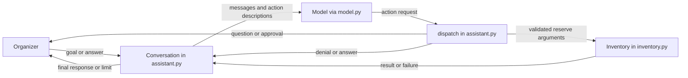

# Worked flow

```mermaid
flowchart LR
    U[Organizer] -->|goal or answer| C[Conversation in assistant.py]
    C -->|messages and action descriptions| M[Model via model.py]
    M -->|action request| D[dispatch in assistant.py]
    D -->|question or approval| U
    D -->|validated reserve arguments| I[Inventory in inventory.py]
    I -->|result or failure| C
    D -->|denial or answer| C
    C -->|final response or limit| U
```

Categorization follows a fixed path: inventory item names, one model call,
validation by Inventory.categorize, then saved categories. It has no action loop.
